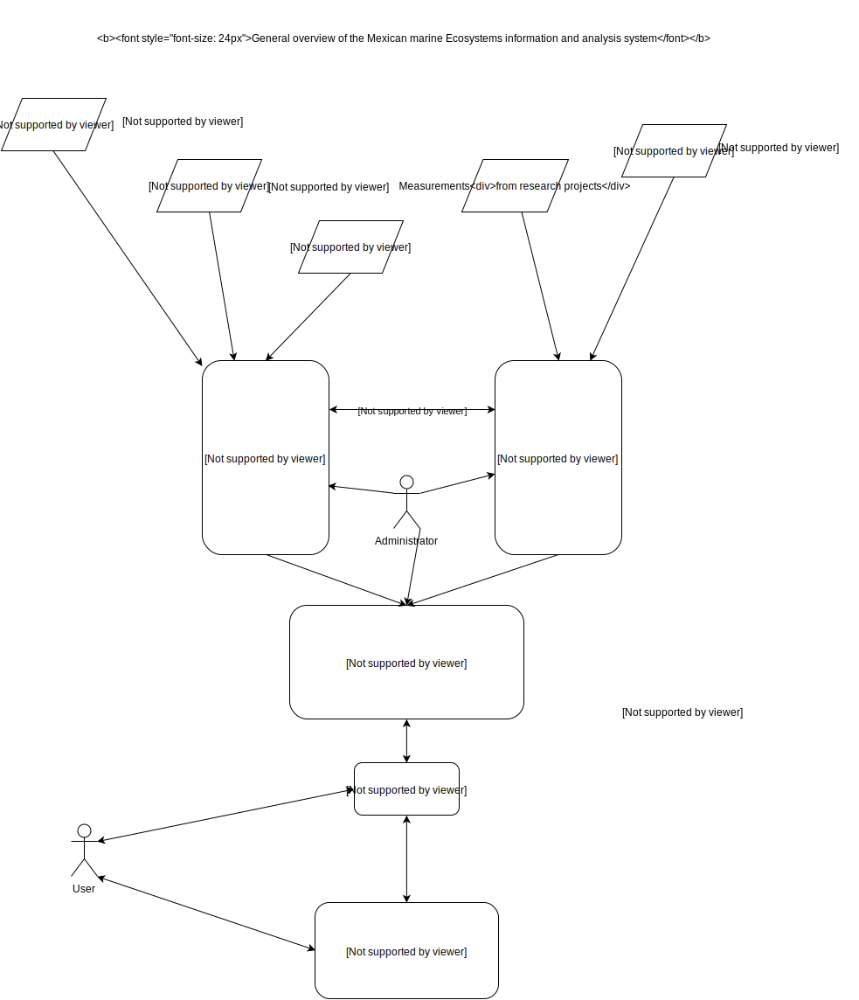

# SATMO and the Mexican's ocean monitoring and analysis system

## Mexican marine ecosystems information and analysis system, general overview

SATMO is the satellite component of a complete marine monitoring and analysis system (*sistema de información y análisis de ecosistemas marino-costeros de México*). Another important component of the system will be the in-situ monitoring component. The in-situ system will ingest, analyze, and use both near real and a non-real time data (from buoys, stations, existing networks, university researchers, and crowd-sourcing). The data generated by the in-situ component of the system will play an important role in:

- Validation of SATMO outputs
- Analysis aimed at answering research questions
- Generation of alerts

The overall system can be summarized with the conceptual diagram below.

Therefore *SATMO should be a point where analysis ready data from various satellite sources is available, facilitating efficient analysis with well integrated and up to date datasets.*

Direct applications of the overall system will be:

- Alert, forecast and early warning system for issues such as

	- Sargassum blooms (Detect and forecast future locations according to ocean currents)
	- Algae blooms (Including rapid alert to inform sanitary authorities that can subsequently test for toxicity)
	- Risks of coral bleaching

- Facilitated centralized access to various kind of data and information about seas and oceans

These activities should result in:

- An improved knowledge and understanding of marine ecosystems and dynamics
- A better capacity to monitor, protect, and manage marine ecosystems

## SATMO details

SATMO roles are to:

- Provide facilitated access to up to date information on various ocean parameters measurable by satellite

This implies that SATMO must

- Download relevant archived and upcoming satellite data in an operational manner
- Gather auxiliary products for required for analysis and forecasting (e.g. Ocean currents)
- Compute ecologically relevant variables
- Produce and update information required to compute anomalies

