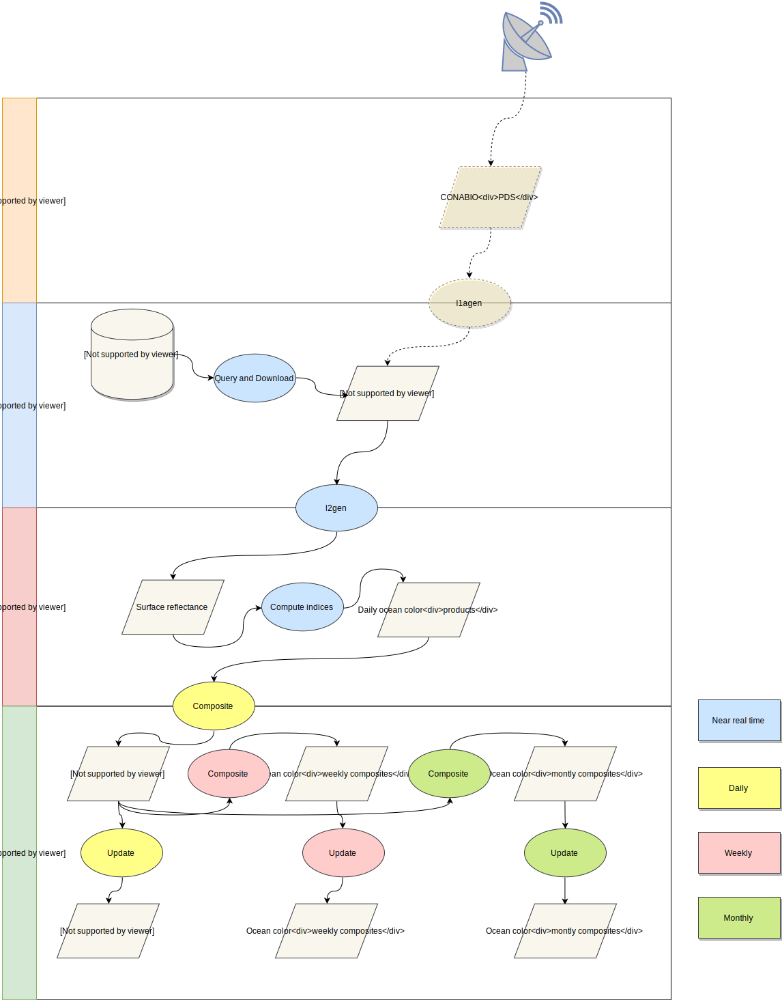

# SATMO and the Mexican's ocean monitoring and analysis system

## Mexican marine ecosystems information and analysis system, general overview

SATMO is the satellite component of a complete marine monitoring and analysis system (*sistema de información y análisis de ecosistemas marino-costeros de México*). Another important component of the system will be the in-situ monitoring component. The in-situ system will ingest, analyze, and use both near real and a non-real time data (from buoys, stations, existing networks, university researchers, and crowd-sourcing). The data generated by the in-situ component of the system will play an important role in:

- Validation of SATMO outputs
- Analysis aimed at answering research questions
- Generation of alerts

The overall system can be summarized with the conceptual diagram below.

Therefore *SATMO should be a point where analysis ready data from various satellite sources is available, facilitating efficient analysis with well integrated and up to date datasets.*

Direct applications of the overall system will be:

- Alert, forecast and early warning system for issues such as

	- Sargassum blooms (Detect and forecast future locations according to ocean currents)
	- Algae blooms (Including rapid alert to inform sanitary authorities that can subsequently test for toxicity)
	- Risks of coral bleaching

- Facilitated centralized access to various kind of data and information about seas and oceans

These activities should result in:

- An improved knowledge and understanding of marine ecosystems and dynamics
- A better capacity to monitor, protect, and manage marine ecosystems

## SATMO details

SATMO roles are to:

- Provide facilitated access to up to date information on various ocean parameters measurable by satellite

This implies that SATMO must

- Download relevant archived and upcoming satellite data in an operational manner
- Gather auxiliary products for required for analysis and forecasting (e.g. Ocean currents)
- Compute ecologically relevant variables
- Produce and update information required to compute anomalies

## Detailed description of the ingestion and processing steps

### Data sources

This is a description of the fully automated ingestion and processing module of the SATMO. The main source of raw data is the ocean color [DAAC](http://oceandata.sci.gsfc.nasa.gov/). Processing from L0 to L1A is completely standard and performed automatically and in near real time by the ocean color system. L1A products are therefore preferred over L0 as they maintain all data characteristics and are suitable for re-calibrations, while limiting storage and processing requirements. Alternatively data can be obtained directly from the CONABIO antenna, as it receives, directly from various sensors, Production datasets (PDS). This option however, requires further data processing and is considered secondary at the moment and would only be used in case of dysfunction of the ocean color DAAC or in case of US government shutdown.

### Data download

#### Reflectance data (MODIS, SeaWifs, VIIRS)

Because L1A data are archived according to their acquisition time and not according to their geo-location, the difficulty in setting up an automated download is to identify the right data on the oceancolor servers.
The pragmatic approach for data download are the following:

- When updating archive data, get the list of download urls manually using the [data browser](http://oceancolor.gsfc.nasa.gov/cgi/browse.pl?sen=am), save as text file, place in the appropriate directory (tbd) and run the download updater function.
- For near real time, use a subscription that will automatically select the files and make them available on a daily basis. These files can then easily be retrieved.

Further more automated options will be explored in the future using the common metadata repository or by sending requests to the `browse.pl` API.

### Data processing

Processing is done automatically, triggered by the availability of the required data on the ocean color DAAC, with a flexible and modular design that combines existing tools with custom made solutions. The main pre-processing steps (e.g. generation of L2 surface reflectance data) are supported by the (already existing) SeaDAS processing modules, while later steps of the processing chain are implemented in python.
This flexible design enables the implementation of new algorithms in a timely manner as well as the capacity to accommodate new sensors.

The (daily, weekly and monthly) composites calculated are required to compute and update climatologies for each variables, from which anomalies can be generated.

### L1A to L2bin

We directly generate spatially binned reflectance data using the Can be done in one step using the `multilevel-processor.py` 

## Calculation of indices

## Annex products

- jpg preview
- json file with metadata (download url, preview url, cloud cover, processing date, variables, etc)

These additional output will be later used by the satmo data explorer (a dynamic website that generate product pages based on the content of the ftp site).

## System operation

The system must include both a near real time component -- capable of downloading data as they become available on the oceancolor servers and processing them immediately -- and a component that enables flexible updating or re-processing of different collections when needed.

The different modes are then:

- Near real time operation
- Updating mode (updates a given collection, only missing data are downloaded or processed)
- Re-process mode (reprocesses an entire collection)

## Administration interface

An interface to select variables, start/stop the system, update collections, etc will be designed. Ideally with an authentication system connected to the conabio user database; otherwise using unix accounts of the server on which the system is running.

The interface will be written with the flask python web framework.

Controls of the administration interface would then be:

- Start and stop NRT system
- Chose directories of input and output data
- Select variables to process
- Trigger a collection update or a re-processing

Additionally the interface should display:

- Status
- Errors