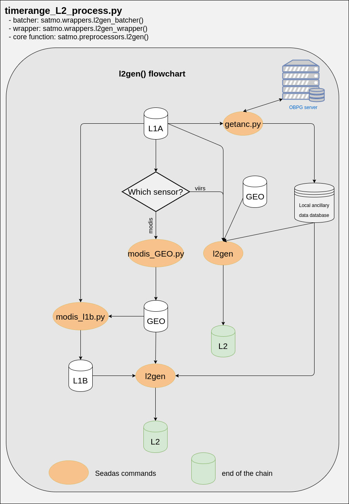

Using the command line interface
--------------------------------

Operation of the two different modes (near real time and update modes) is done via a set of command line, which are detailed below. Every command lines have a consistent syntax and naming convention.

Every command line contains built in documentation that can be accessed by running ``name_of_the_cli.py --help``.

Because most of the commands runs for several hours or even days, it is preferable to run them within a ``nohup`` context. See the example below.

.. code-block:: bash

    # Run a command as a background process (allowing you to close the terminal), and writing the verbose to a log file
    nohup command_name.py --arg1 input1 --arg2 input2 > ~/YYYYMMDD_processing_log.log &

Before starting
^^^^^^^^^^^^^^^

As detailed in the installation section, it is recommended to have installed the satmo package in a python virtual environment. Considering, you have already created a virtual environment named ``satmo``, you have to activate that environment to be able to run a satmo command line. To activate the environment, simply run:

.. code-block:: bash
  
      workon satmo

Starting satmo near real time mode
^^^^^^^^^^^^^^^^^^^^^^^^^^^^^^^^^^

As detailed in the installation instruction, you probably want to start the near real time operation mode automatically as soon as the system boots up, and for that you should add and entry to the linux user crontab. However, it is of course also possible to start satmo near real time mode manually, using the ``satmo_nrt.py`` command.

Running ``satmo_nrt.py --help`` returns the following help page.

.. code-block:: bash

    usage: satmo_nrt.py [-h] -day_vars [DAY_VARS [DAY_VARS ...]] -night_vars
                    [NIGHT_VARS [NIGHT_VARS ...]]
                    [-l1a_vars [L1A_VARS [L1A_VARS ...]]] [--no-refined]
                    [--no-8DAY] [--no-month] -d DATA_ROOT
                    [-map_res MAPPING_RESOLUTION]
                    [-bin_res BINNING_RESOLUTION] -north NORTH -south SOUTH
                    -east EAST -west WEST [-p PROJ]
                    [-flags [FLAGS [FLAGS ...]]] [-delay DELAY]
                    [-multi N_THREADS]

    optional arguments:
      -h, --help            show this help message and exit
      -day_vars [DAY_VARS [DAY_VARS ...]], --day_vars [DAY_VARS [DAY_VARS ...]]
                            day time variables to process
      -night_vars [NIGHT_VARS [NIGHT_VARS ...]], --night_vars [NIGHT_VARS [NIGHT_VARS ...]]
                            night time variables to process
      -l1a_vars [L1A_VARS [L1A_VARS ...]], --l1a_vars [L1A_VARS [L1A_VARS ...]]
                            Additional L2 variables to process from OC2 collection
                            (generated from L1A files)
      --no-refined          Disable download of refined processed L2 data,
                            reprocessing of L2 data from L1A, and L3m processing
                            from them
      --no-8DAY             Disable processing of 8 days temporal composites
      --no-month            Disable processing of monthly temporal composites
      -d DATA_ROOT, --data_root DATA_ROOT
                            Root of the local archive
      -map_res MAPPING_RESOLUTION, --mapping_resolution MAPPING_RESOLUTION
                            Output resolution in meters (defaults to 1000)
      -bin_res BINNING_RESOLUTION, --binning_resolution BINNING_RESOLUTION
                            Output resolution in meters (defaults to 1000)
      -north NORTH, --north NORTH
                            Northern boundary in DD
      -south SOUTH, --south SOUTH
                            Southern boundary in DD
      -east EAST, --east EAST
                            Eastern most boundary in DD
      -west WEST, --west WEST
                            Western most boundary in DD
      -p PROJ, --proj PROJ  Optional Coordinate reference system of the output in
                            proj4 format, or any predifined crs name in seadas
                            l3mapgen. If None is provided, +proj=eqc +lon_0=0 is
                            used
      -flags [FLAGS [FLAGS ...]], --flags [FLAGS [FLAGS ...]]
                            List of flags to use in the binning step. If not
                            provided defaults are retrieved for each L3 suite
                            independently from the satmo global variable FLAGS
      -delay DELAY, --delay DELAY
                            NUmber of days to wait before triggering refined
                            reprocessing of the L2 OC2 suite from L1A
      -multi N_THREADS, --n_threads N_THREADS
                            Number of threads to use for parallel implementation

    Command Line utility to control the operational mode of the satmo system 
    Enables download of L2 and L1A data from OBPG server (NRT and refined processing), processing of L3m files for several night and 
    day variables, processing of daily composites, and processing of temporal composites. 
    All these download and processing steps are scheduled and ran operationally. 
    Daily composites and temporales composites are enabled by default 
    Use the --no-daily_compose, --no-8DAY, and --no-16DAY to disable their generation 

    ------------------
    Example usage:
    ------------------

    satmo_nrt.py --day_vars chlor_a nflh sst Kd_490 --night_vars sst --l1a_vars afai fai --north 33 --south 3 --west -122 -multi 3 

Update mode
^^^^^^^^^^^

Update mode is used primarilly to download and process archive data. All command start by the prefix ``timerange``, indicating that their action apply to a range of dates defined by a ``--begin`` and ``--end`` argument. The full list of functions is presented in the table below.

+-----------------------------------+-----------------------------------------------------------------------------+---------------------------------------------------------------+
| CLI name                          | description                                                                 | Should be ran after                                           |
+===================================+=============================================================================+===============================================================+
| ``timerange_download.py``         | Downloads data from the OBPG servers to a local archive                     | None                                                          |
+-----------------------------------+-----------------------------------------------------------------------------+---------------------------------------------------------------+
| ``timerange_L2_process.py``       | Generates L2 products from L1A                                              | ``timerange_download.py``                                     |
+-----------------------------------+-----------------------------------------------------------------------------+---------------------------------------------------------------+
| ``timerange_L2_append.py``        | Computes additional variables and appends the result to an existing L2 file | ``timerange_L2_process.py`` or ``timerange_download.py``      |
+-----------------------------------+-----------------------------------------------------------------------------+---------------------------------------------------------------+
| ``timerange_L2m_process.py``      | Maps L2 product variables to a plattecarre projection                       | ``timerange_L2_process.py`` or ``timerange_download.py``      |
+-----------------------------------+-----------------------------------------------------------------------------+---------------------------------------------------------------+
| ``timerange_bin_map.py``          | Performs spatial binning and mapping of a variable across multiple L2 files | ``timerange_L2_process.py`` or ``timerange_download.py``      |
+-----------------------------------+-----------------------------------------------------------------------------+---------------------------------------------------------------+
| ``timerange_time_compositing.py`` | Perform temporal binning and mapping of a variable                          | ``timerange_bin_map.py``                                      |
+-----------------------------------+-----------------------------------------------------------------------------+---------------------------------------------------------------+
| ``timerange_daily_composite.py``  | Average L3m products across different sensors                               | ``timerange_bin_map.py``                                      |
+-----------------------------------+-----------------------------------------------------------------------------+---------------------------------------------------------------+
| ``make_preview.py``               | Generate png preview of a L3m file                                          | ``timerange_bin_map.py`` or ``timerange_time_compositing.py`` |
+-----------------------------------+-----------------------------------------------------------------------------+---------------------------------------------------------------+

Downloading data
""""""""""""""""

The ``timerange_download.py`` command line can be used to download data from the OBPG servers to a local archive. It supports downloading L1A as well as L2 files, with the option to select the suite in case of L2 download, and to choose between night or day data. Running ``timerange_download.py --help`` displays the help page of the command line interface.

.. warning:: Downloading full speed causes problems of breaking connection, it is therefore preferable to limit download speed with tools like **trickle**.

The example below illustrates a download process (L1A data) with speed limited to 3MBps.

.. code-block:: bash

    # Download L1A data with speed limited to 3 MB/s
    nohup trickle -d 3000 timerange_download.py --terra --aqua -b 2010-01-01 -e 2012-12-31 -north 32 -south 4 -west -121 -east -73 -d /some/directory/with/free/space > YYYYMMDD_download_log.log &

Examples usage
++++++++++++++

* L1A data download

.. code-block:: console

    $ nohup timerange_download.py --terra --aqua --viirs -b 2000-02-24 -e 2016-12-31 -north 32 -south 4 -west -121 -east -73 -d /export/isilon/datos2/satmo2_data/ > ~/dl_log.log &

* L2 data download

.. code-block:: console

    # Ocean color variables (Blue reflectances, chlor\_a, etc)
    nohup timerange_download.py --terra --aqua --viirs -b 2000-02-24 -e 2016-12-31 -north 32 -south 4 -west -121 -east -73 -p OC --no-night -d /export/isilon/datos2/satmo2_data/ > ~/dl_log.log &

    # Day time SST
    nohup timerange_download.py --terra --aqua --viirs -b 2000-02-24 -e 2016-12-31 -north 32 -south 4 -west -121 -east -73 -p SST --no-night -d /export/isilon/datos2/satmo2_data/ > ~/dl_log.log &

    # Night time SST
    nohup timerange_download.py --terra --aqua --viirs -b 2000-02-24 -e 2016-12-31 -north 32 -south 4 -west -121 -east -73 -p SST --no-day -d /export/isilon/datos2/satmo2_data/ > ~/dl_log.log &

Processing L2 data from L1A
^^^^^^^^^^^^^^^^^^^^^^^^^^^

The command line ``timerange_L2_process.py`` processes L2 files from L1A. The command line is a wrapper (and batcher) around the seadas utility ``l2gen``. The figure below details the processing chain triggered by the command line.

Examples usage
++++++++++++++

.. code-block:: bash

    # Process a L2 suite called OC2 that contains Rayleight corrected reflectances 
    timerange_L2_process.py --aqua --terra --viirs -b 2014-01-01 -e 2014-12-31 -v rhos_nnn -s OC2 -d /export/isilon/data2/satmo2_data -multi 3

Generating additional L2 variables
^^^^^^^^^^^^^^^^^^^^^^^^^^^^^^^^^^^

The ``timerange_L2_append.py`` command line enables computing additional variables from bands present in an L2 file. The new index/band layer is appended to the L2 file from which the input were taken.

The list of variables that can be processed using that command line can be found in ``satmo.global_variables.BAND_MATH_FUNCTIONS``. Edit that variable in the satmo source code following the existing model to enable processing of additional variables. 

Examples usage
++++++++++++++

.. code-block:: bash

    # Process afai and append it to the OC2 L2 suite generated by the command above 
    timerange_L2_append.py --aqua --terra --viirs -b 2014-01-01 -e 2014-12-31 -v afai -s OC2 -d /export/isilon/data2/satmo2_data -multi 3

Generating mapped L2 variables
^^^^^^^^^^^^^^^^^^^^^^^^^^^^^^^^^^^

The ``timerange_L2m_process.py`` runs seadas ``l2mapgen`` on individual L2 file, to produced mapped products.

Examples usage
++++++++++++++

.. code-block:: bash

    # Process afai and append it to the OC2 L2 suite generated by the command above 
    timerange_L2_append.py --aqua --terra --viirs -b 2014-01-01 -e 2014-12-31 -v afai -s OC2 -d /export/isilon/data2/satmo2_data -multi 3

Generating mapped L3m variables
^^^^^^^^^^^^^^^^^^^^^^^^^^^^^^^^^^^

The ``timerange_bin_map.py`` runs seadas ``l2bin`` and ``l3mapgen`` sequentially, hence producing L3m products. It also produces L3b files (one for each collection), which are intermediary output in that case, but required inputs for the temporal compositing command line (``timerange_time_compositing.py``).

The ``l2bin`` utility uses default masking values fetched from a global variable named ``FLAGS`` and located at ``satmo.global_variables``. Edit this variable to change the default values.

Examples usage
++++++++++++++

.. code-block:: bash

    # Process chlor_a, night sst, sst, and chl_ocx for viirs, aqua and terra between 2000 and 2017 
    timerange_bin_map.py --aqua --terra --viirs -b 2000-01-01 -e 2017-12-31 -south 3 -north 33 -west -122 -east -72 -d /export/isilon/datos2/satmo2_data -bin_res 1 -map_res 1000 -day_vars chlor_a chl_ocx sst -night_vars sst -multi 6

Generating temporal composites
^^^^^^^^^^^^^^^^^^^^^^^^^^^^^^^^^^^

The ``timerange_time_compositing.py`` runs seadas ``l3bin`` and ``l3mapgen`` sequentially, hence producing mapped temporal composites.

Examples usage
++++++++++++++

.. code-block:: bash

    # Generate 8 days composites for aqua, viirs and terra for the period 2000-2017 (for chlor_a, chl_ocx, sst and night sst)
    timerange_time_compositing.py --aqua --terra --viirs -b 2000-01-01 -e 2017-12-31 -delta 8 -day_vars chlor_a chl_ocx sst -night_vars sst -north 33 -south 3 -west -122 -east -72 -d /export/isilon/datos2/satmo2_data

Data visualization
^^^^^^^^^^^^^^^^^^

Satmo comes with a command line for generating preview of existing georeferenced tiff files. It produces png files, with continents and coastlines, and supports linear as well as logarithmic scaling of the variable. Variables have to be referenced in the global variable ``VIZ_PARAMS``, located at ``satmo.global_variables``. Do not set ``vmin`` to zero for a log scaled variable since the logarithm of zero is not defined.

The example below produces the figure at the end of this page.

.. code-block:: bash

    make_preview.py A2006001.L3m_MO_CHL_chlor_a_1km.tif
    make_preview.py A2006001.L3m_MO_SST_sst_1km.tif

.. image:: img/A2006001.L3m_MO_CHL_chlor_a_1km.png
.. image:: img/A2006001.L3m_MO_SST_sst_1km.png

