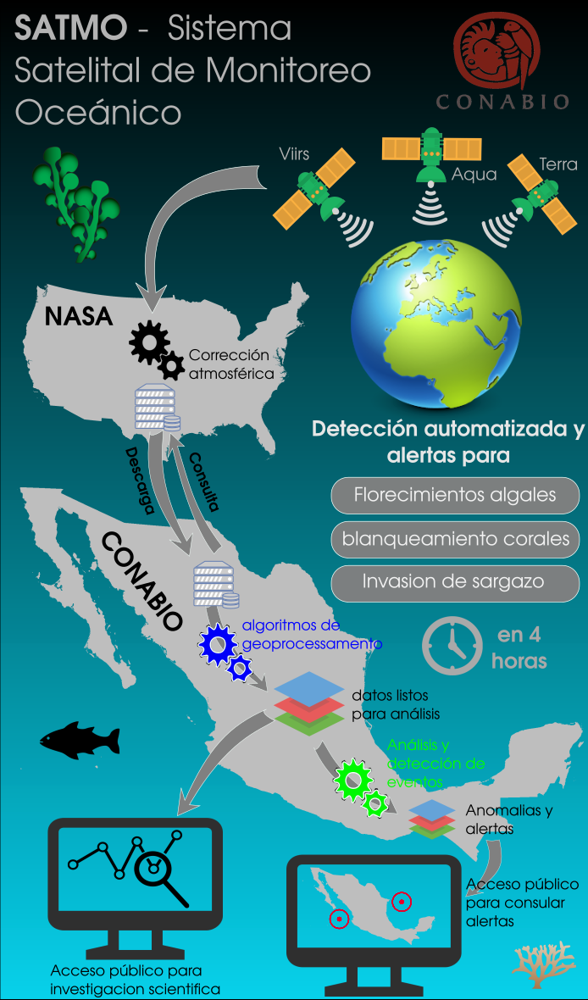
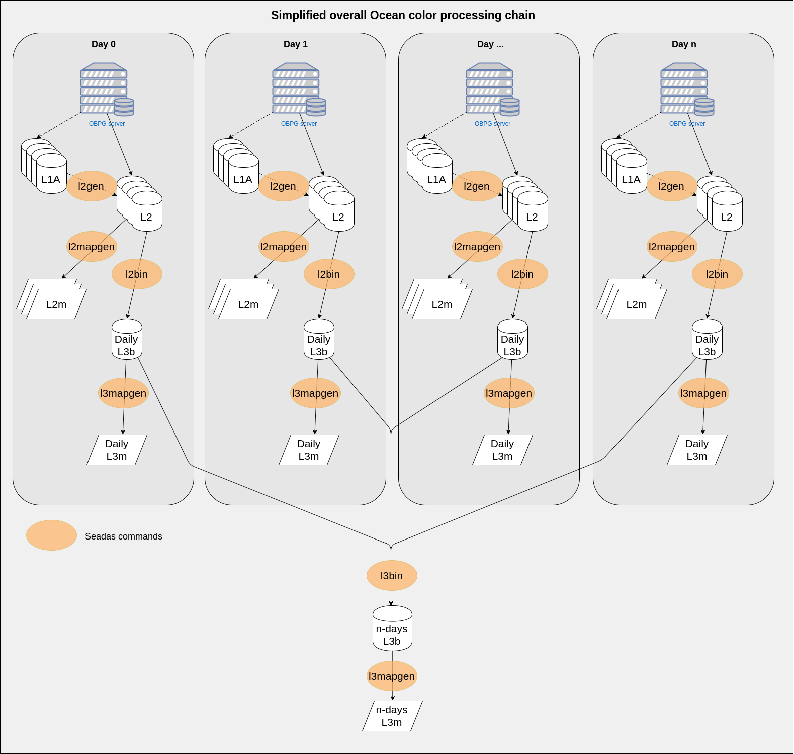
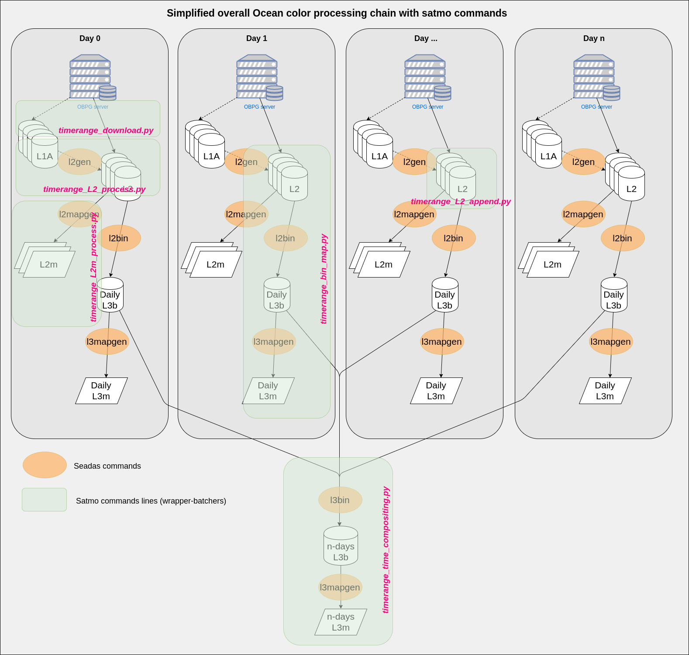

Background
----------

SATMO is the satellite component of a complete marine monitoring and analysis system (*sistema de información y análisis de ecosistemas marino-costeros de México*).
Direct applications of the satmo system are:

- Alert, forecast and early warning system for issues such as:

    - Algae blooms
    - Risks of coral bleaching
    - Arrival of Sargassum and drift forecast

- Facilitated centralized access to various kind of data and information about seas and oceans

These activities should result in:

- An improved knowledge and understanding of marine ecosystems and dynamics
- A better capacity to monitor, protect, and manage marine ecosystems

Characteristics of the SATMO system
-----------------------------------

Specific roles of SATMO are to:

- Provide facilitated access to up to date information on various ocean parameters measurable by satellite
- Generate alerts of risks of coral bleaching, algae blooms, and presence of sargassum
- Facilitate analysis of ocean color data, jointly with other data sources (e.g. In-situ data from the SIDMO system)

This implies that SATMO must:

- Ingest relevant archived and upcoming satellite data in an operational manner
- Ingest auxiliary products required for analysis and forecasting (e.g. Ocean currents)
- Compute ecologically meaningful and relevant variables, and project them to a common grid 
- Apply event detection algorithms to the satellite image time-series for the generation of alerts
- Include a data distribution platform (e.g.: ftp server)
- Include a data visualization platform (e.g.: Geo-portal)
- Have Various data access tools (API)
- Function automatically and in near real time

Satmo operating modes
----------------------

Satmo has two operating modes; a near real time mode, that ingests and processes data a few hours after aquisition by the sensors, and a update mode, to download and reprocess archive data. The two modes are further detailed below.

Near real time mode
^^^^^^^^^^^^^^^^^^^

The near real time operating mode of the system allows download of recently acquired data and processing to level 3m (L3m), including generation of temporal composites. It can be started with a single command line available as part of the satmo package (``satmo_nrt.py``).

The figure below provides a simplified overview of the overall ocean color data processing chain handled nightly by the satmo near real time system.

Update mode
^^^^^^^^^^^

The update mode allows data download from the Ocean Biology Processing Group servers and processing to level 3m (L3m) for a user defined time-range and set of variables. These functionalities are exposed via a set of command lines.

The figure below presents a simplified version of the overall download and processing chain, with the corresponding satmo command line utilities superimposed.

